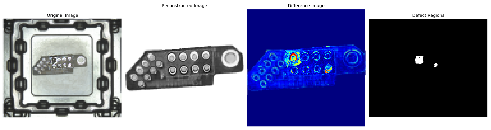

# VAE-CycleGAN Unsupervised Anomaly Detection

This project implements an unsupervised anomaly detection algorithm based on VAE-CycleGAN for image reconstruction. The algorithm combines the power of Variational Autoencoder (VAE) and CycleGAN to detect anomalies in images without the need for labeled data.

# VAE-CycleGAN 无监督异常检测

本项目实现了一种基于 VAE-CycleGAN 的图像重建无监督异常检测算法。该算法结合了变分自编码器 (VAE) 和 CycleGAN 的优势,无需标注数据即可检测图像中的异常。

## Features

- Unsupervised learning: No need for labeled anomaly data
- VAE-based image reconstruction
- CycleGAN architecture for stable training and local discrimination
- Segment Anything Model (SAM) for automatic image segmentation
- Data augmentation techniques for improved performance
- Use MAML Meta learning to train a general model for avoiding overfitting.

## 特点

- 无监督学习:无需标注异常数据
- 基于 VAE 的图像重建
- CycleGAN 架构,实现稳定训练和局部判别
- Segment Anything Model (SAM) 自动图像分割
- 数据增强技术,提升存在缺陷时重建的性能
- 使用元学习得到更好的通用模型，避免过拟合。

## Architecture

The VAE-CycleGAN model consists of two main components:

1. **VAE Generator**: A Variational Autoencoder that learns to reconstruct normal images. It consists of an encoder and a decoder network.

2. **PatchGAN Discriminator**: A discriminator network from CycleGAN that provides local feedback on the reconstructed images.

The model is trained to minimize the reconstruction loss between the input images and their reconstructions, as well as the adversarial loss from the discriminator. In our implementation of CycleGAN, we modified the cyclic reconstruction process. Instead of the original cyclic reconstruction, we input the original image A to obtain the reconstructed image B, then input the reconstructed image B to obtain a new reconstructed image C. This modification greatly enhances the model's ability to handle images with anomalies.

## 架构

VAE-CycleGAN 模型由两个主要组件构成:

1. **VAE 生成器**:一个变分自编码器,学习重建正常图像。它由编码器和解码器网络组成。

2. **PatchGAN 判别器**:来自 CycleGAN 的判别器网络,对重建图像提供局部反馈。

该模型通过最小化输入图像与其重建图像之间的重建损失,以及来自判别器的对抗损失来进行训练。在我们的 CycleGAN 实现中,我们修改了循环重建过程。我们不采用原始的循环重建,而是将原始图像 A 输入以获得重建图像 B,然后将重建图像 B 输入以获得新的重建图像 C。这种修改大大增强了模型处理含有异常的图像的能力。

## Usage

1. Prepare your dataset of normal images.
2. Use the Segment Anything Model (SAM) in `CutTarget.py` to automatically segment the objects of interest in the images.
3. Train the VAE-CycleGAN model on the segmented images using the `VAE_GAN_train.py` script. Prepare the training images (normal samples) and test images (samples not seen during training or defective samples) before running the script.
4. To perform anomaly detection, use the `main.py` script. Modify the input image path and the model paths: one discriminator model for determining the accuracy of SAM segmentation, and the VAE model for reconstruction. The defect results will be saved in the `./output` folder by default.

## 使用方法

1. 准备正常图像数据集。
2. 使用 `CutTarget.py` 文件来调用 Segment Anything Model (SAM) 自动分割图像中感兴趣的对象。
3. 使用 `VAE_GAN_train.py` 脚本在分割后的图像上训练 VAE-CycleGAN 模型。在运行脚本之前,准备好训练图片(正常样本)和测试图片(模型训练时没有见过的样本或有缺陷样本)。
4. 进行缺陷检测时,使用 `main.py` 脚本。修改输入图片路径和模型路径:一个辨别器模型用于判断 SAM 的切割内容是否准确,以及用于重建的 VAE 模型。缺陷结果默认保存在 `./output` 文件夹中。

## References

- Variational Autoencoder (VAE)
- CycleGAN
- [Segment Anything Model (SAM)](https://github.com/facebookresearch/segment-anything)

## 参考

- 变分自编码器 (VAE)
- CycleGAN
- [Segment Anything Model (SAM)](https://github.com/facebookresearch/segment-anything)

## Effect

## 效果演示

